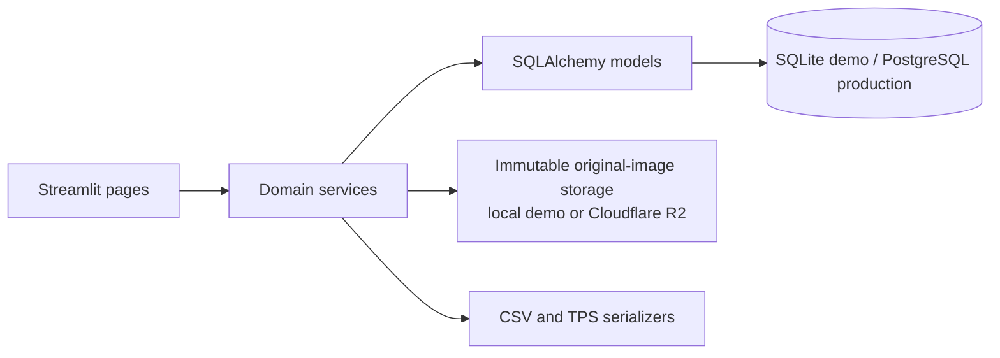
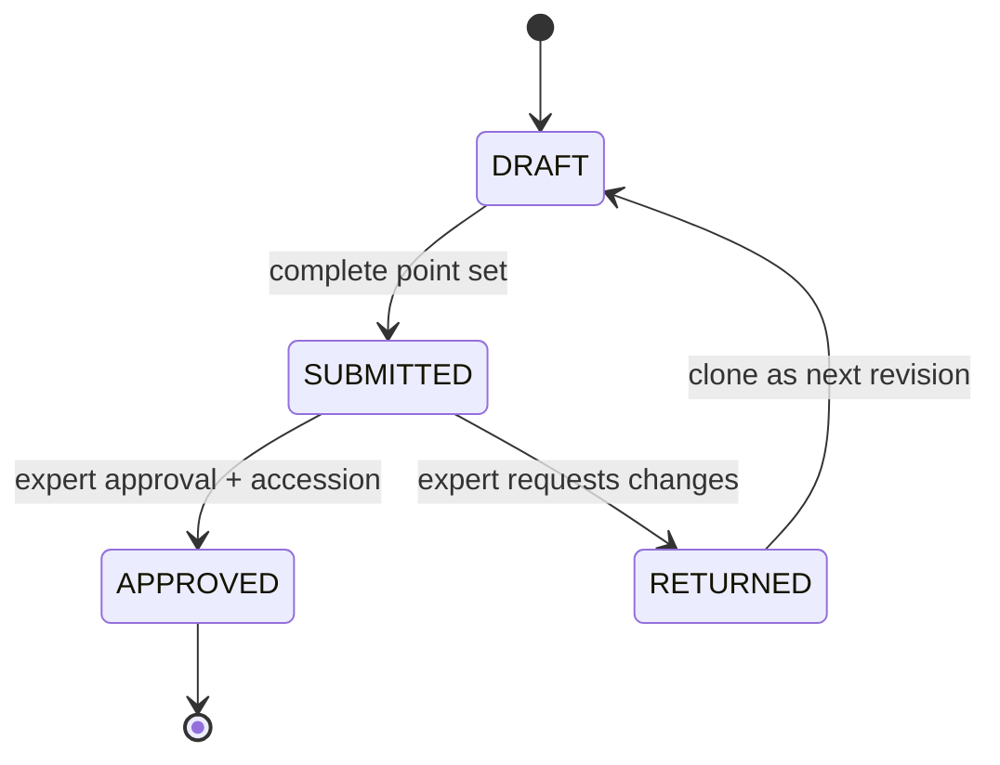

# Global Insect Wing Repository — Version 0.1 Architecture

## Purpose and scope

Version 0.1 is a local-first, role-based Streamlit application for manually
digitizing **right forewings of Hymenoptera**. It proves the complete curation
path from a student's specimen record and immutable image upload through
template-specific landmark submission, expert review, permanent accessioning,
repository browsing, and CSV/TPS export.

It deliberately does not implement morphometric search, PCA, automated
landmark detection, worldwide federation, or cross-template analysis.

## System shape



The modules have intentionally narrow responsibilities:

- `app.py` starts Streamlit and selects pages according to the authenticated
  role.
- `wing_repository/ui/` renders pages and manages Streamlit session state. UI
  code does not perform direct status transitions.
- `wing_repository/services/` owns authorization-aware workflow transitions,
  image persistence, coordinate validation, accession allocation, and export.
- `wing_repository/models.py` defines persistence entities and database-level
  constraints.
- `wing_repository/db.py` configures sessions and enables SQLite foreign keys.
- `alembic/` contains schema migrations. Production and long-lived local
  databases are upgraded with Alembic, never with ad-hoc table creation.

## Roles and page access

| Page | Student | Reviewer | Administrator |
|---|---:|---:|---:|
| Login | Yes | Yes | Yes |
| Student dashboard | Yes | No | No |
| Specimen metadata | Yes | No | No |
| Wing-image upload | Yes | No | No |
| Manual digitization | Yes | No | No |
| My submissions | Yes | No | No |
| Expert review | No | Yes | Yes |
| Repository browser | Yes | Yes | Yes |
| TPS and CSV export | Yes | Yes | Yes |
| Administration summary/assignments | No | No | Yes |

Authorization is enforced again inside domain services; hiding a Streamlit
page is not considered a security boundary.

## Core data model

- **Users** have exactly one role: administrator, student, or expert reviewer.
- **Taxa** are genus-level Hymenoptera records with a stable, manually assigned
  uppercase `genus_code`. The code is part of permanent accessions and is not
  recomputed from a renamed taxon.
- **Landmark templates** belong to one taxon and one explicit version. Their
  ordered **template landmarks** define the required point sequence.
- **Assignments** connect one student to one genus and an exact template
  version. Version 0.1 permits one active assignment per student.
- **Specimens** contain contributor-supplied collection and voucher metadata
  and belong to the assigned taxon.
- **Wing images** point to preserved original bytes and record their checksum,
  original raster dimensions, MIME type, and the fixed side/type
  `RIGHT`/`FOREWING`.
- **Annotations** point to one exact image and one exact template version.
  **Annotation points** store both source-raster pixel coordinates and the
  required normalized coordinates.
- **Reviews** record an expert's approve/return decision and comments for one
  immutable submitted annotation revision.
- **Repository records** are created only for approved revisions and bind a
  permanent accession to the image, coordinates, taxon, template, and review.

## Workflow and immutability



A draft can be edited freely. Submission requires exactly one point for every
ordered template landmark. Once submitted, its point rows are immutable. A
returned annotation remains preserved and is cloned into a new draft revision;
the student edits the clone. An approved revision is terminal and append-only.

Template identity is carried by foreign key throughout the workflow and is
included in exports. The application never merges, compares, averages, or
otherwise combines coordinates from different template IDs or versions.

## Coordinate system

Digitization is performed against a display derivative that uses the original
stored raster orientation without implicit EXIF rotation. Click positions are
mapped back to the original raster dimensions before saving.

For an image of `image_width × image_height`, each point stores:

```text
x_pixel, y_pixel
x_normalized = x_pixel / image_width
y_normalized = y_pixel / image_height
```

Coordinates are zero-origin floating-point pixel positions with bounds
`0 <= x_pixel < image_width` and `0 <= y_pixel < image_height`. Normalized
values are saved rather than recomputed only at export, so both submitted
representations remain part of the preserved scientific record.

## Original-image preservation

Uploaded bytes are validated with Pillow, hashed with SHA-256, and written once
under a generated storage key. The application never rewrites an existing
original. Display overlays are generated in memory and are not substitutes for
the original. The database stores the original filename, byte count, checksum,
MIME type, source-raster dimensions, and immutable storage key.

Version 0.1 supports two original-image storage backends behind the same
service interface:

- `local` writes under `WBR_DATA_DIR/originals` for development and disposable
  single-user demonstrations.
- `r2` writes to Cloudflare R2 through its S3-compatible API for hosted
  Streamlit deployments where local files are ephemeral.

The database remains the authoritative index for image metadata and scientific
records. Object storage is the authoritative source for original image bytes.

## Approval and accession transaction

Approval performs all of the following in one database transaction:

1. Lock the genus's accession counter.
2. Validate reviewer role, contributor separation, status, template, and point
   completeness.
3. Create the approval review.
4. Allocate the next per-genus serial without recycling gaps.
5. Create the repository record and accession.
6. Mark the exact annotation revision approved.

The accession format is
`WBR-HYM-{GENUS_CODE}-{SIX_DIGIT_SERIAL}`. Unique constraints protect both the
accession string and `(taxon, serial)`. A repeated approval request is
idempotent and returns the existing repository record.

PostgreSQL row locking supplies production concurrency control. SQLite is only
the single-user demonstration backend.

## Digitizer boundary

The milestone uses a small, established Streamlit image-coordinate component
for reliable click capture. The server creates a numbered overlay after each
click and saves each mapped coordinate immediately. Undo-last and explicit
point deletion are handled by ordinary Streamlit controls.

A production-quality interaction with cursor-centered zoom, pan, hit-testing,
drag-to-adjust, touch/pen input, keyboard shortcuts, and a continuously updated
high-resolution overlay requires a purpose-built Streamlit TypeScript
component. That component is an explicit future boundary; it must return both
the rendered viewport transform and coordinates so original-pixel mapping can
be tested rather than inferred.

## Deployment and secrets

Configuration comes from environment variables. SQLite plus local image storage
is the documented local default. Hosted or multi-user deployments use a
PostgreSQL SQLAlchemy URL and durable object storage, currently Cloudflare R2.
Passwords are stored as salted PBKDF2 hashes. Demo account passwords are read
by the seed command from environment variables and are not embedded in
application source.

## Future-safe constraints

- No PCA columns or identifiers exist in Version 0.1. Future derived analyses
  must identify their dataset, template version, preprocessing, and algorithm
  version and remain reproducible from raw coordinates.
- Accessions are never edited or reused. A future withdrawal mechanism should
  retain the repository row and add status/reason metadata.
- Published templates should be treated as immutable; corrections create a new
  version.
- PostgreSQL, object storage, audit logging, institutional identity, and a
  custom digitizer component are production hardening work, not hidden behind
  the local demo.
